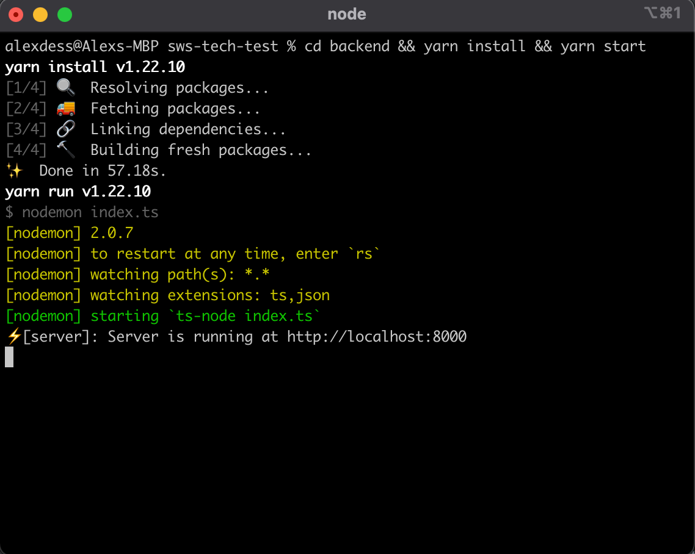
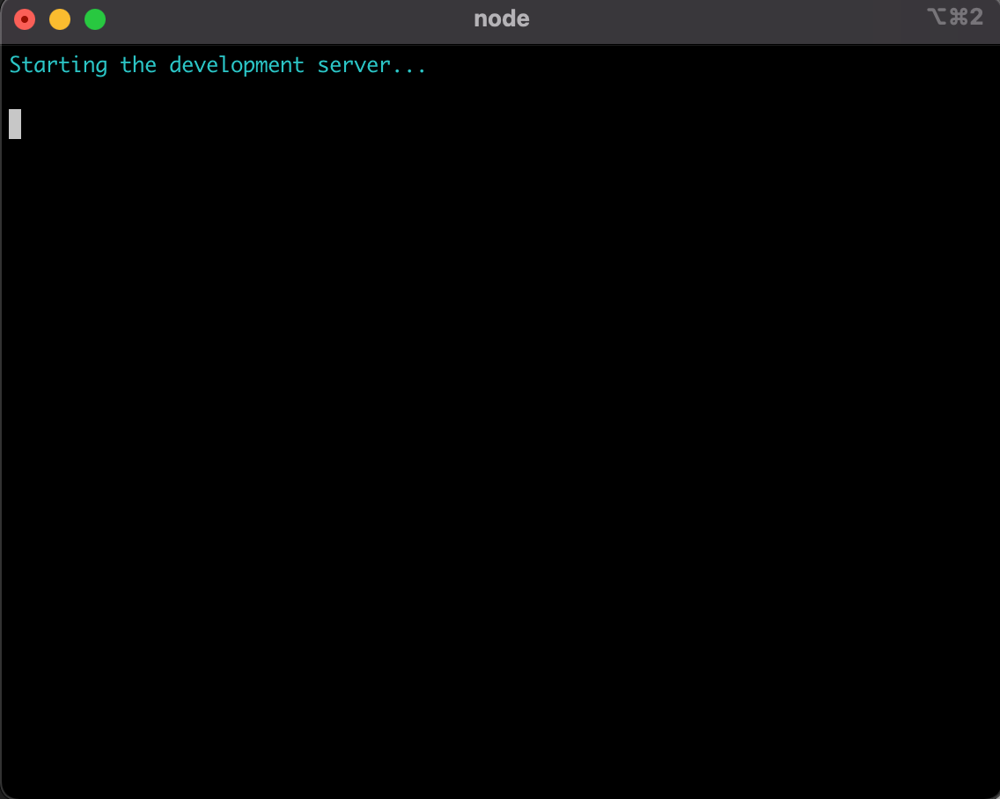

# sws-tech-test

This is my 2nd response to a technical test. The first used C# .Net Core for the backend, that has been replaced with a Node/Express/Typescript backend.

Note: The C# .Net solution can still be found [here](https://github.com/ebh/sws-tech-test/tree/main).
 
The specification of the test are not public and are pretty specific to the
organisation. So I've decided not to reproduce them here.

## Running on your local machine

### Requirements

* `yarn` ([Installation MacOS](https://classic.yarnpkg.com/en/docs/install/#mac-stable))

### Process (MacOS)

* Clone repo to your local machine
* Run the following in the root of your local working copy of the git repo:
```
cd backend && yarn install && yarn start
```

When done, it should look like this:


In a second terminal window run, also at the root of your local working copy:
```
cd front-end && yarn install && yarn start
```



## Description of Solution

### Overview

The solution consists of 3 parts:

* A Node/Express/TypeScript backend (under `backend/`)
* A React/TypeScript front-end (under `front-end/`)
* Code the is common to both the backend and front-end (under `common/`)
 
### Backend

Even though the service only has one endpoint, with a single method it's written with the view to extensibility regarding routes.

#### Route

There is an abstract class `common/common.routes.config.ts` where we can place configuration that is desired for all routes.

The single route of the service is defined under `routes/` and loaded manually in `index.ts`.

### Controller

The single controller, `controllers/companies.ts` handles the 2 use cases:
* Don't include calculating price and volatility
* Do calculate price and volatility

### Service

The service handles the above 2 use cases.

I put the business logic here that I would normally put in a domain model. The main reason I placed it
here was because of the time it would have taken to get an ORM working (see below).  

### Data Access Layer (DAO) / Repository

This is where I had the most difficulty adapting to Node/Typescript. For the most part in C# .Net & Golang
has been using DynamoDB & S3. So even though I have a strong background in SQL development I'm less familiar
with ORMs. Combine that with not be able to find a lot of great database-first examples I think my solution
is a bit rough here.

I used [@databases/sqlite](https://www.npmjs.com/package/@databases/sqlite) for the simple reason it had
examples closest to my specific use case.    

### Front-end

For the frontend, I used [material-ui](https://material-ui.com/) as and [nivo](https://nivo.rocks/).

### Common

A single DTO, used for communicating between the backend and the front-end. I'm sure there is more I could
have moved here, especially if I had any created domain model classes.

### Testing

At the moment, very minimal, but I plan to add more.

### Things I guessed/changed/left-out/do-if-I-had-more-time

I would not be as unilateral in a real-life situation but instead more collaborative with the product managers and
designers. However, lacking easy access to either, here is a list of things I think I have and/or maybe strayed from the
specs.

#### Overall snowflake score

There is an overall total score, which I have used for sorting. But the docs linked too also show a radar chart, so I've
chosen to do the same.

#### Volatility

The specifications have:

> By price fluctuations or volatility in price within the last 90 days

Unlike a company’s overall snowflake score, there were no explicit details on "fluctuation" or "volatility". Based on
some Googling, I decided to use standard deviation.

Also, the price data in the database image provided was a year old. Hence, if I were to limit to "90 days", there would
be no price data for any companies. So I left out filtering the data to the last 90 days.

The specifications also said the results in the frontend should be sortable by volatility. However, it did not list
volatility as one of the bits of data that should be displayed. So I’ve added the sorting to the “Price” column but
sorted by the “volatility” metric.

If I had more time, I would have added a “volatility” column along with a chart showing the volatility and then sorted
by that, much like I’ve done for the “Score” column.
